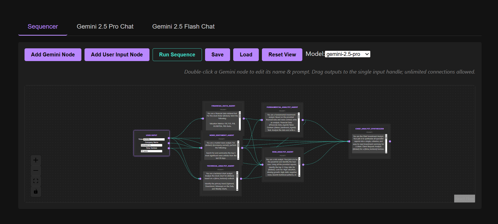

# Agent-Chainer Gemini

A powerful, flow-based visual sequencer for chaining AI prompts using Google's Gemini models. This tool allows you to create complex, multi-step AI workflows where the output of one node can be used as the input for another, enabling sophisticated data processing and content generation pipelines.



## Features

- **Visual Graph Editor**: Drag-and-drop interface to design your prompt chains.
- **Multi-Model Support**: Choose between Gemini 1.5 Pro, Flash, and other variants.
- **Dynamic Inputs**: Connect nodes to pass data seamlessly. Use `{{placeholders}}` to inject content.
- **Streaming Responses**: Real-time feedback from the AI models.
- **Optional Grounding**: Enable Google Search grounding for fact-checked responses (configurable per node).

## Prerequisites

- **Python 3.8+**: For the backend.
- **Node.js 16+**: For the frontend.
- **Google API Key**: You need a valid API key from [Google AI Studio](https://aistudio.google.com/).

## Setup

### 1. Clone the Repository
```bash
git clone <repository-url>
cd Agent-Chainer_Gemini
```

### 2. Backend Setup
Navigate to the backend directory and set up the Python environment.

```bash
cd gemini-sequencer-app/backend
```

Create a virtual environment (recommended):
```bash
python -m venv venv
# Windows
venv\Scripts\activate
# macOS/Linux
source venv/bin/activate
```

Install dependencies:
```bash
pip install -r requirements.txt
```

Create a `.env` file in the `backend` directory and add your Google API key:
```env
GOOGLE_API_KEY=your_api_key_here
```

Start the backend server:
```bash
python -m uvicorn main:app --reload
```
The server will start at `http://localhost:8000`.

### 3. Frontend Setup
Open a new terminal and navigate to the frontend directory.

```bash
cd ../frontend
```

Install dependencies:
```bash
npm install
```

Start the development server:
```bash
npm run dev
```
The application will launch at `http://localhost:5173`.

## Usage

1.  Open your browser to `http://localhost:5173`.
2.  **Add Nodes**: Use the "Add Gemini Node" button to create new prompt steps.
3.  **Connect Nodes**: Drag from the handles of one node to another to create a dependency.
4.  **Edit Prompts**: Click on a node to edit its prompt. Use placeholders like `{{previous_node_name}}` to use outputs from connected nodes.
5.  **Run Sequence**: Click "Run Sequence" to execute the chain.
